# Cache

## Aufgabenstellung

Das Ziel dieses Projektes ist der Vergleich von direkt abbildenden und voll-assoziativen Caches mit verschiedenen Konfigurationen in Bezug auf Zyklenzahl, Gatterzahl und Hit/Miss-Rate. 

## Rechercheergebnisse
### Übliche Größen für Caches und ihre Latenzen
Direkt-abbildende Caches:

- L1 Größe: 16 KB bis 64 KB
- L2 Größe: bis zu 1 MB
- Verwendungen: [Intel x86- und AMD-Architekturen](https://ieeexplore.ieee.org/document/7569243)

Voll-assoziative Caches:

- L1 Größe: 8 KB und 64 KB
- Verwendung: Translation Lookaside Buffer (z.B. Instruction- und Data-TLBs von [Intel® 64 und IA-32 Architekturen](https://www.intel.com/content/www/us/en/content-details/671488/intel-64-and-ia-32-architectures-optimization-reference-manual-volume-1.html))
  - L1-TLBs: Zwischen 32 und 256 Einträge
  - L2-TBLs: bis zu 2048 Einträge

[Latenz:](https://www.intel.com/content/dam/develop/external/us/en/documents/performance-analysis-guide-181827.pdf)
- Zwischen 1 und 40 Zyklen, abhängig vom Cache-Level
- Von etwa 60 bis 150 Zyklen beim Hauptspeicher (Von-Neumann-Flaschenhals)

### Speicherzugriffsverhalten von Merge- und Radixsort
Wir untersuchen im folgenden die Speicherzugriffsmuster der Algorithmen [Merge- und Radix-Sort](tools/BenchmarkInputGenerator/Sort.h). Diese haben [ein stark unterschiedliches Zugriffsmuster](https://doi.org/10.1006/jagm.1998.0985): Merge-Sort weist eine höhere räumliche Lokalität auf als Radix-Sort. In [eigener Messung](tools/BenchmarkInputGenerator/BenchmarkInputGenerator.py) war die durchschnittliche Adressabweichung bei aufeinanderfolgenden Memory-Accesses bei Radix-Sort zw. etwa 13% und 60% höher, wobei diese mit größerem Sortier-Array steigt. Weiters weist Merge-Sort auch eine höhere temporale Lokalität auf, da auf jedem Merge-Segment bestimmter Größe genau 1 Mal operiert wird, während Radix-Sort mehrmals das gesamte Array durchläuft.

## Methodik & Messumgebung

Das Speicherzugriffsmuster der Algorithmen wurden mithilfe eines [LLVM-Passes](tools/MemoryAnalyser/MemoryAnalyser.cpp) für verschiedene Eingabegrößen analysiert und [aufgezeichnet](examples/merge_sort_10.csv). Der LLVM-Pass instrumentiert während des Kompilierprozesses jeden Speicherzugriff mit einem Aufruf zu einer Log-Funktion, die diesen Zugriff im richtigen Format an ein erstelltes Log-File anfügt.

Diese Algorithmen werden zur Vereinfachung auf einem System in reiner Harvard-Architektur simuliert, in welchem ein CPU über je einen Cache mit Instruktions- und Daten-RAM verbunden ist. Variierbare Parameter an diesem System sind die Cachelatenz, Memorylatenz, Cacheline-Größe, Cacheline-Zahl, der Mapping-Typ und die Replacement-Policy des Caches.
## Implementierung

Das Design dieses [Caches](src/Simulation/Cache.h) ist angelehnt an das Buch [Computer Organization and Design](http://home.ustc.edu.cn/~louwenqi/reference_books_tools/Computer%20Organization%20and%20Design%20RISC-V%20edition.pdf). Kommt es zu einem Cache Miss wird, egal ob Lese- oder Schreibzugriff, erst die Cacheline in den Cache geladen und dann entweder ein 32 Bit Wort an den RAM gesandt oder das gelesene Wort an die CPU. Um durch Writes weniger Zeit zu verlieren, gibt es einen [Write-Buffer](src/Simulation/WriteBuffer.h), wodurch die CPU bereits nach einlesen der Zeile in den Cache den nächsten Befehl ausführen kann. Dieses Verhalten ist ausschaltbar über die Definition von STRICT_INSTRUCTION_ORDER. Das bei der Messung simulierte System besteht aus in Harvard-Architektur organisierten [CPU](src/Simulation/CPU.h), [Instruktion](src/Simulation/InstructionCache.h)- und Datencache sowie Instruktions- und Daten-[RAM](src/Simulation/RAM.h).

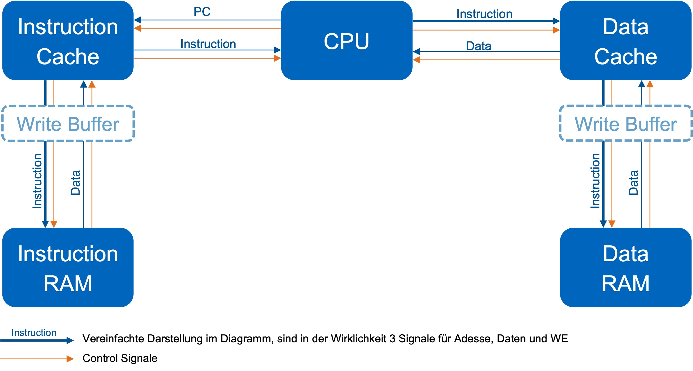

## Ergebnisse

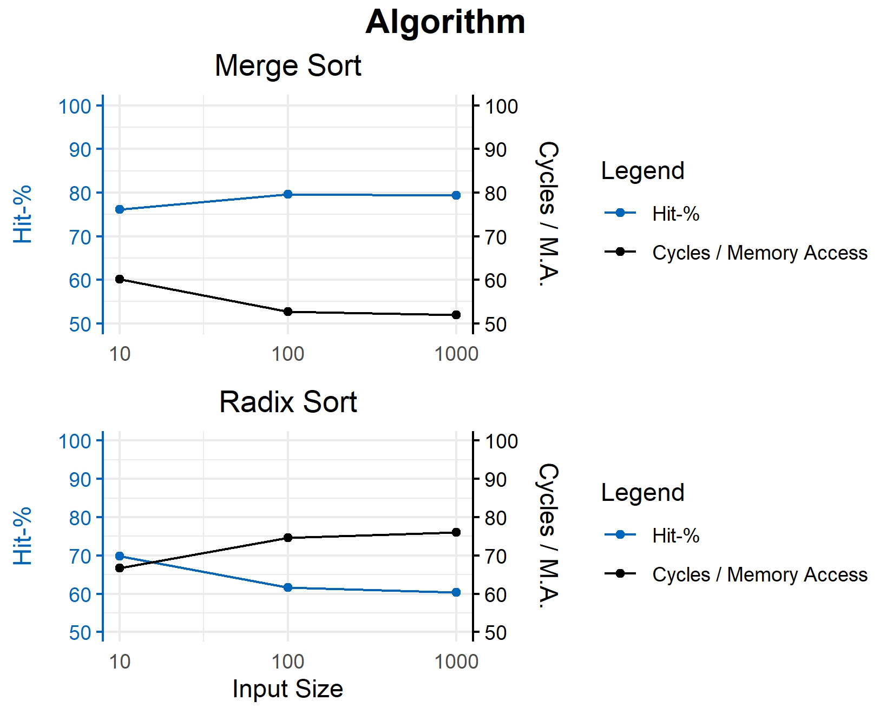

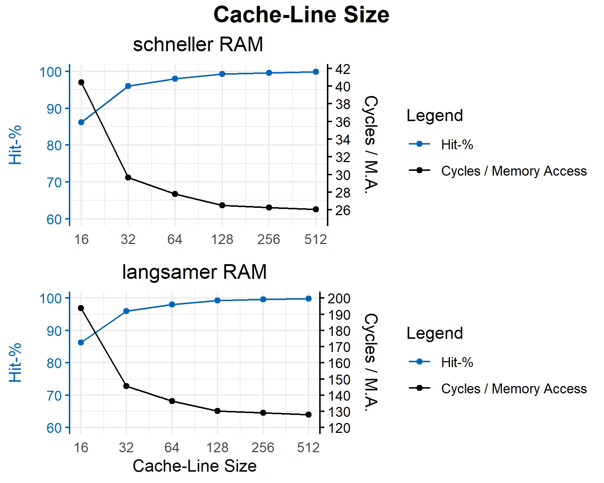

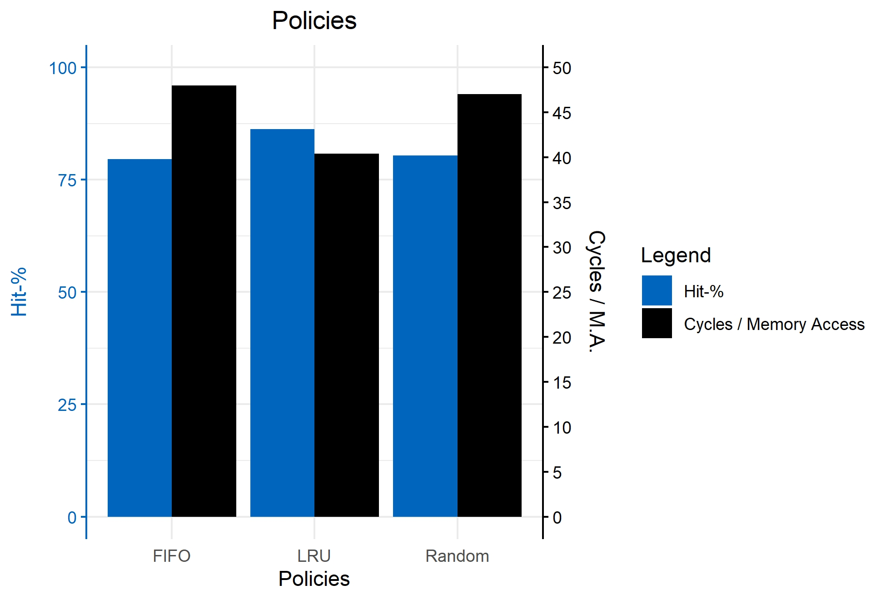

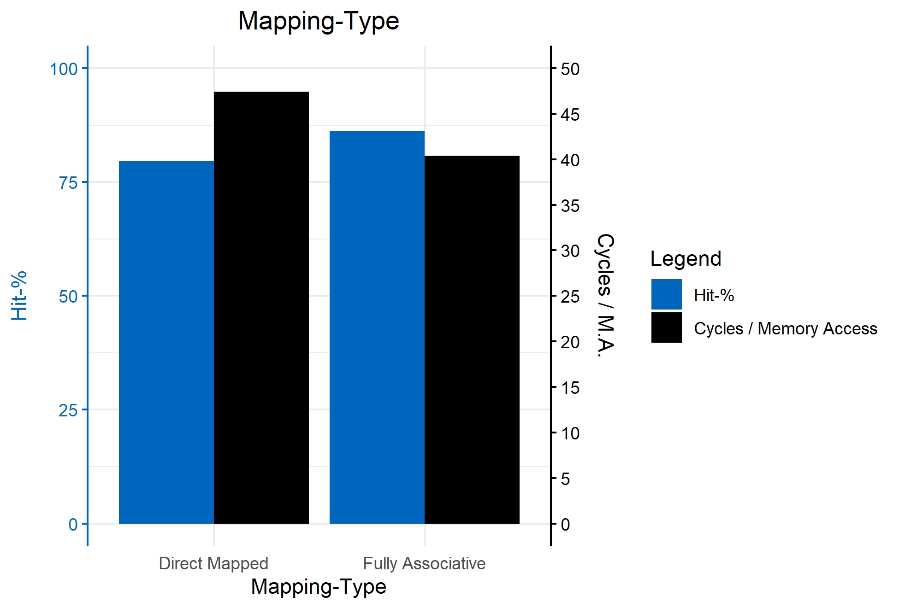

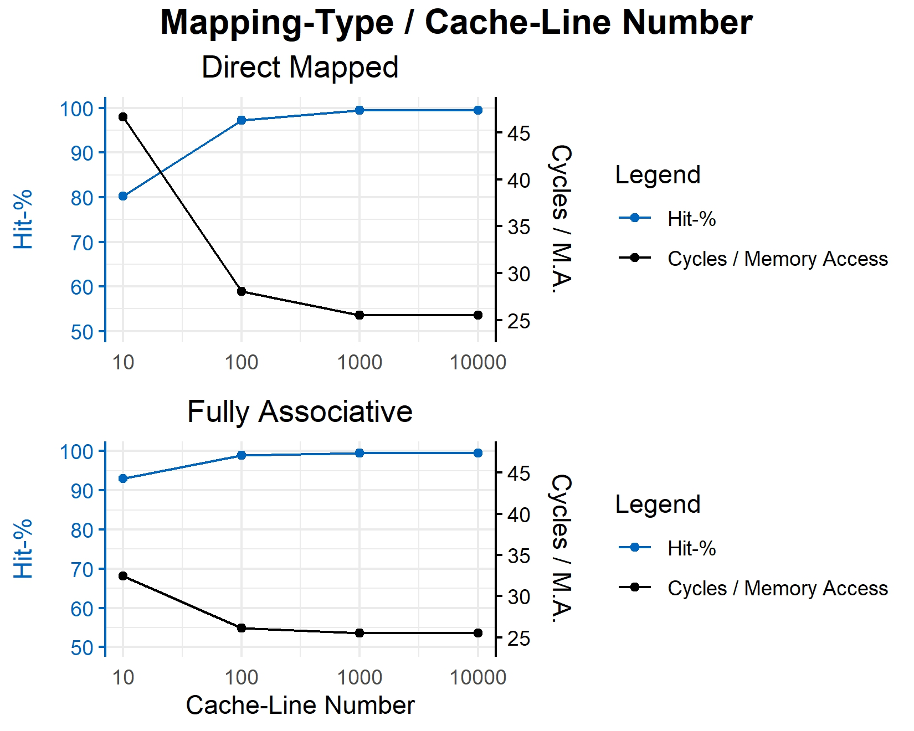

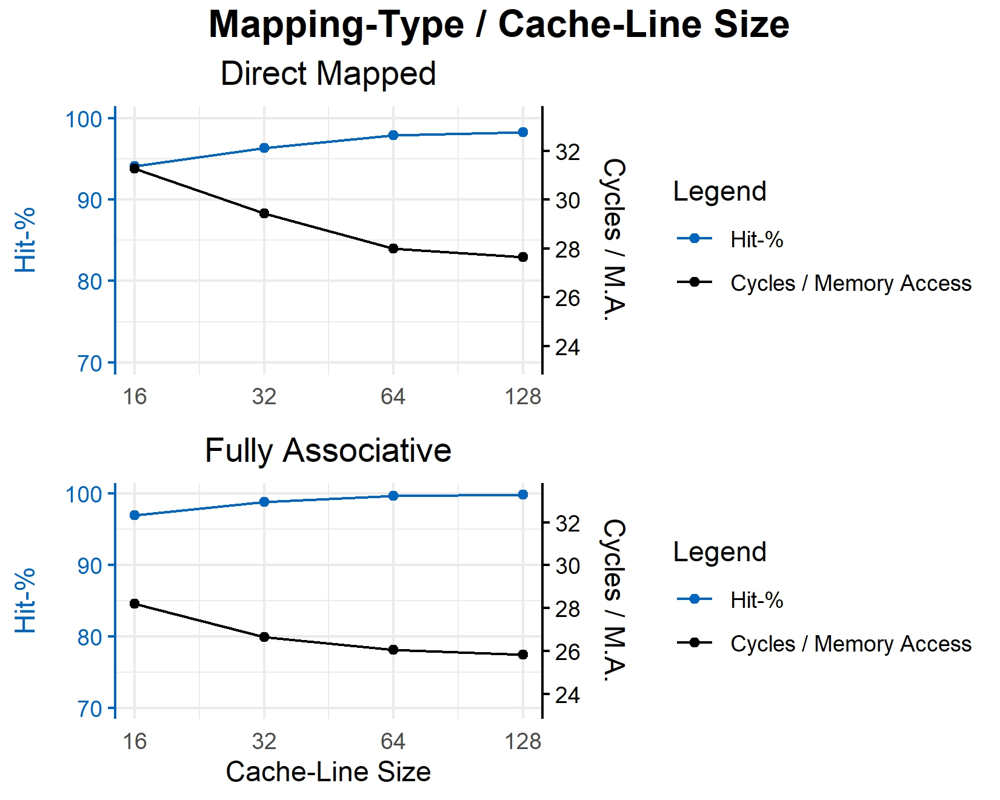

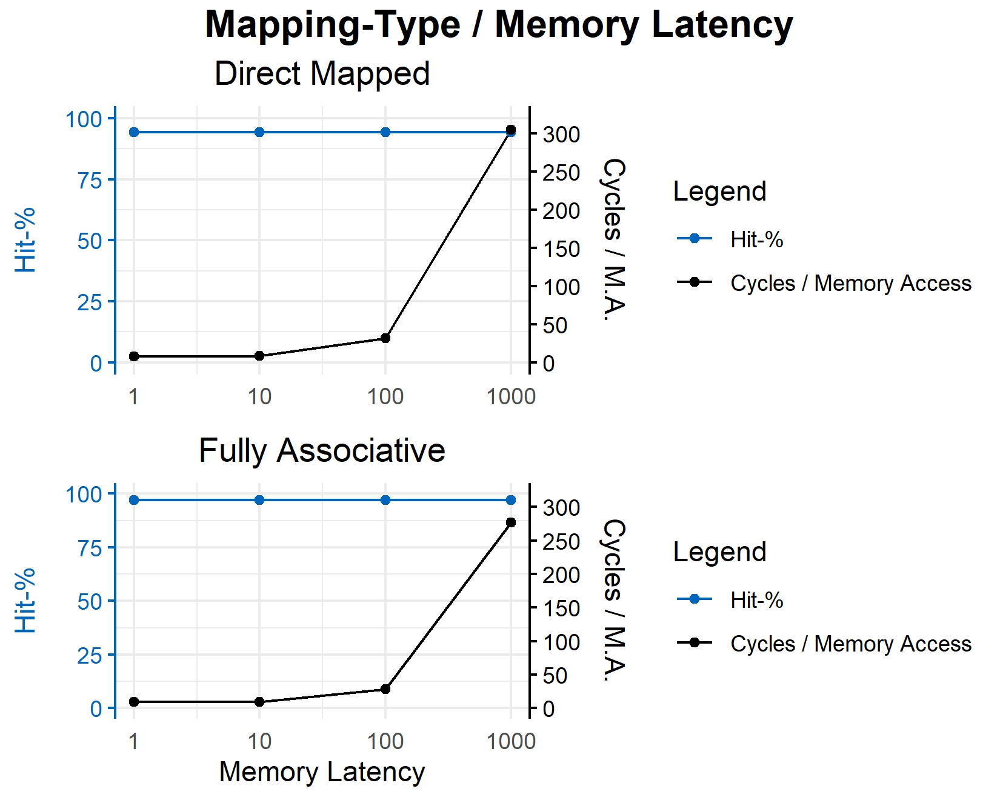

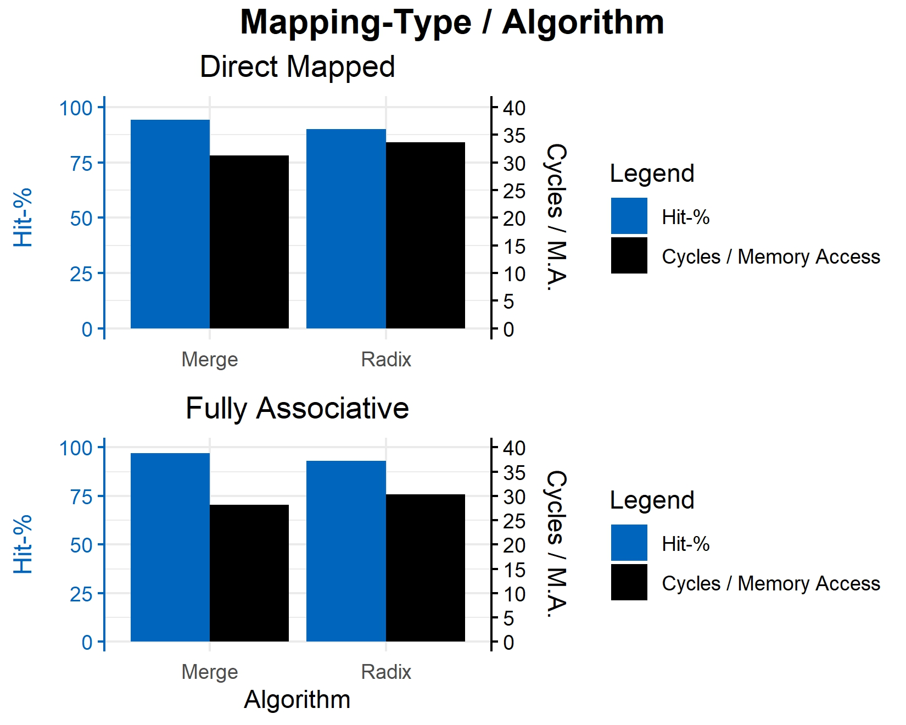

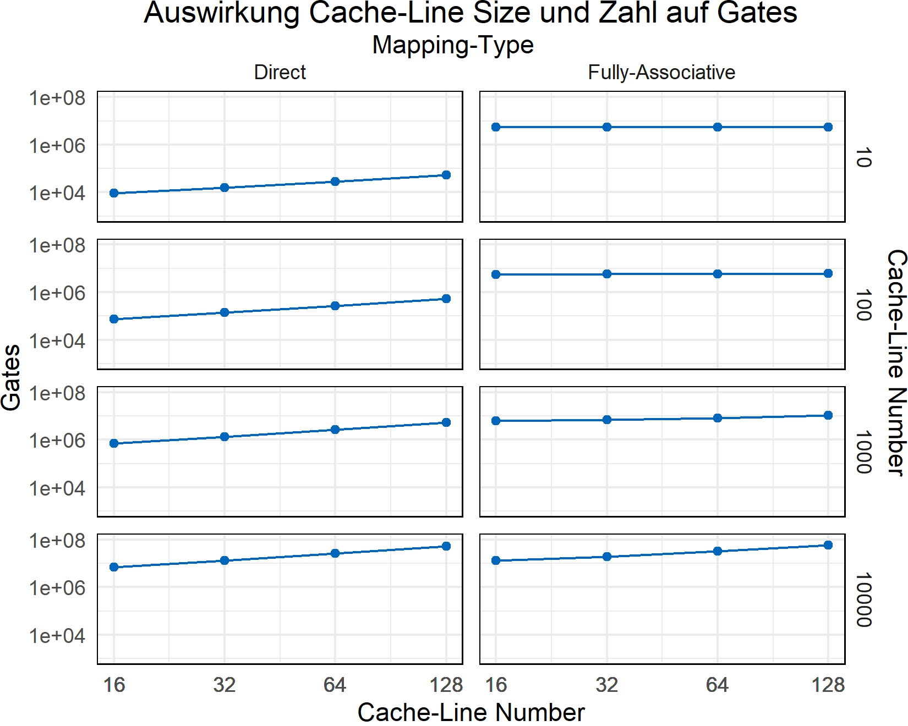

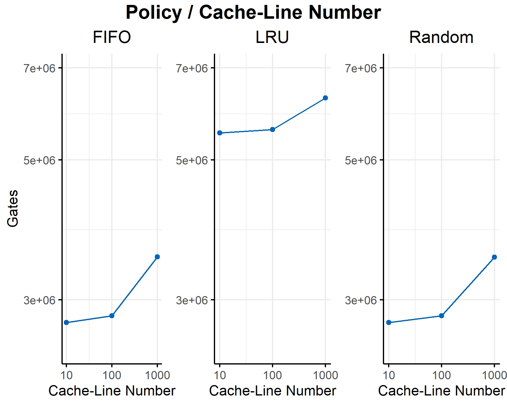

## Persönliche Beiträge
- Dominik: Cache, Write-Buffer, Speicherzugriffsanalyse, Design Intermodulkommunikation, Tests
- Emina: CPU, RAM, Tests, Aufsetzen der Simulation 
- Matilda: C-Rahmenprogramm, Recherche, Tests, Projekt-Management

## Quellen 
[1] D. A. Patterson und J. L. Hennessy, Computer Organization and Design: The Hardware/Software Interface: RISC-V Edition, 5. Aufl., San Francisco: Morgan Kaufmann, 2021, Kapitel 5, pp. [754-804].

[2] S. Kumar und P. K. Singh, "An overview of modern cache memory and performance analysis of replacement policies," 2016 IEEE International Conference on Engineering and Technology (ICETECH), Coimbatore, Indien, 2016, S. 210-214, doi: 10.1109/ICETECH.2016.7569243.

[3] Intel, Intel® 64 and IA-32 Architectures Optimization Reference Manual: Volume 1, Order Number 248966-048, August 2023, Sec. 4.1.7.